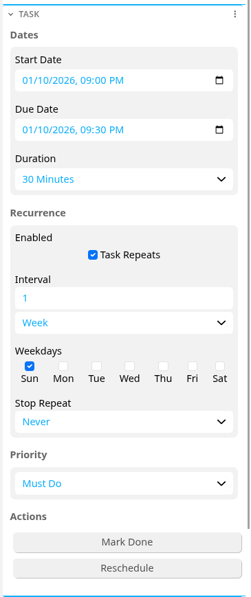

# Agenda Task Widget

## Overview

This is a powerful widget for converting tasks into notes.

## Features

* Date & Time Management
  * Set Start and Due Date Labels
  * Separate Date and Time Labels also created for both to enable compatibility with Trilium's calendar view
  * Duration Selector with 15 preset durations and automatic inclusion in note title
  * Due date automatically generated if both start date and duration present
* Powerful recurrence management
  * Supports daily, weekly, monthly, yearly repeats
  * Supports customizable interval of repeats (eg. 2 days, 3 months, 5 years)
  * Supports repeating on specific weekdays (eg. Repeat every 2 weeks on Wednesday and Friday)
  * Supports repeating on specific days of the month (eg. Repeat Every 3 months on the Third Friday)
  * Supports stopping repeats after a certain number of repetitions or after a specific date and time
* Priority Selection with optional colour coding
* Task update functions
  * Reschedule Today
    * Sets the start date of the task to the present day, preserving the previous start time
  * Reschedule tomorrow
    * Sets the start date of the task to the next day, preserving the previous start time
  * Mark done
    * If the task does not recur or its recurrence has expired, set the #archived tag
    * If the task should recur
      * Update the start date to the next available date
      * Clear all checkboxes in the note's content and all its children
      * Unarchive the note and all its children

