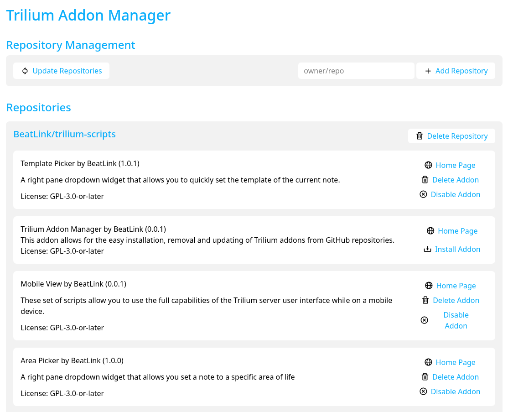

# Trilium Addon Manager (TAM)



Browse available addons at **https://beatlink.github.io/trilium-scripts/**

> ⚠️ **Work in progress.** TAM's manifest format and its Database/persistence model are under
> active development and changing frequently. Data loss is possible. Install this to test and
> explore only — do not use it to manage real/production Trilium data yet.

## Overview

Trilium Addon Manager (TAM) is a widget-based addon installer for [TriliumNext Notes](https://github.com/TriliumNext/Notes). It lets you install, update, enable, disable, and remove addons from any manifest URL — a single addon directly, or a whole catalog of them — without leaving Trilium. Addons are described by a `_tam_manifest_.json` file that tells TAM what notes to create, how to wire them together, and how to handle updates. An addon's files don't need to live anywhere near its manifest — each note's own `sourceUrl` can point anywhere on the web, so an addon can be composed entirely from files hosted in someone else's repository.

---

## Architecture

TAM is itself an addon. Once installed, its note tree looks like this:

```
trilium-addon-manager@beatlink  (render note)
├── Database  (JSON code note)
│   ├── Addons  (text note — addon root)
│   └── Addon Data  (JSON code note — persistence root)
└── Source Code  (JSX render script)
    ├── libTAM.js  (frontend JS library)
    └── TAM.css  (appCss stylesheet)
```

**Relations wired at install time:**

| From | Relation | To |
|------|----------|----|
| `trilium-addon-manager@beatlink` | `renderNote` | `TAM.jsx` |
| `TAM.jsx` | `displayNote` | `trilium-addon-manager@beatlink` |
| `libTAM.js` | `database` | `Database` |
| `libTAM.js` | `addonRoot` | `Addons` |
| `libTAM.js` | `addonPersistence` | `Addon Data` |

### Key notes

- **Database** — a JSON code note that holds all TAM state: the list of added catalog URLs and, per addon, a single merged record covering its installed state, own manifest structure, persisted data, and pending update prompts (see [The Database Record](#the-database-record) and [Persistence](#persistence)). TAM reads and writes this note on every operation.
- **Addons** — the parent note under which all installed addons are placed as children.
- **Addon Data** — the parent note under which persistence copies of addon data notes are stored (see [Persistence](#persistence)).
- **libTAM.js** — the frontend library that does all the heavy lifting. It runs in the browser but uses `api.runOnBackend` and `api.runAsyncOnBackendWithManualTransactionHandling` for operations that need backend access (fetching URLs, creating notes, modifying note content).
- **Source Code** — a plain empty parent note, existing only to group the actual widget code and its
  own children under a clearly-labeled branch of the tree (same shape as any addon's `root` wrapping
  multiple env variants — see CLAUDE.md's "JS/JSX code note mime" section).
- **TAM.jsx** — the Preact/JSX render widget, nested under **Source Code**. It calls functions from
  `libTAM.js` (available globally as `libTAMjs`) and manages UI state.

### The UI

TAM's own widget is a self-contained Preact app (`TAM.jsx`), styled to match the
GitHub Pages catalog (`docs/`) — same card grid, type badges, search/filter toolbar, and sidebar
detail layout — while still adapting to Trilium's light/dark theme via its own CSS custom properties
for surfaces and text. It has **no addon dependencies of its own** (`dependencies: []` in its own
manifest) — everything below is built directly against `trilium:preact`'s built-in components rather
than a shared library like `libsettings@beatlink`, since a dependency failure in the addon manager
itself would risk taking down the one thing that could otherwise fix it.

- **List view** (default) — a searchable, filterable card grid of every installed addon (libraries
  excluded — see [Hidden libraries](#hidden-libraries-and-update-propagation)) merged with every
  not-yet-installed addon from every added catalog (fetched live and deduped by id against what's
  already installed), so it shows everything available across every added catalog plus anything
  manually installed by URL, not just what's already on disk. Clicking an installed card opens its
  detail view; clicking a not-yet-installed one shows an **Install** button.
- **Catalog browse view** — fetches a specific catalog's `tam-addons[]` list and every manifest it
  points at, fresh, every time (nothing about a catalog's contents is ever cached — see
  [The Database Record](#the-database-record)). Not-yet-installed entries show an **Install** button;
  already-installed ones open the normal detail view instead. Reached via the **Browse** button on
  that catalog's row in the Settings view, not from the main list.
- **Addon detail view** — one page per addon (mirroring `docs/{addon-id}/index.html`): a sticky
  sidebar with the addon's metadata table and full action set (Home Page, Install/Delete,
  Enable/Disable, Settings, Update), and a main panel with the description and — for
  installed addons that declare a `readmeNote` — the addon's own README rendered from its locally
  installed note (see [`readmeNote`](#readmenote-optional)), no network fetch required.
- **Settings view** — TAM's own housekeeping page, built manually (no `libsettings@beatlink`
  dependency): a stats overview (catalog count, installed addon count, addons with saved/persisted
  data, addons with an update available), catalog management (each catalog's row has **Browse**,
  **Visit Website**, and **Delete** actions, plus adding a new catalog by URL), a single-addon
  "install by URL" action, and maintenance triggers (Check for Updates, Update All Addons, Validate
  Database, Clean Up Empty Persistence Roots).

---

## Note Identity: `#TAMFILEID`

Every note TAM creates or resolves gets a permanent label: `#TAMFILEID="{addonId}/{localId}"` (e.g.
`#TAMFILEID="libical@kewisch/lib"`). This label — not any id TAM caches in the Database — is the
canonical way to answer "which real Trilium note is local id X of addon Y": the note carries its
own identity, so it can always be found directly by searching Trilium's own attribute index
(`api.getNoteWithLabel("TAMFILEID", value)`), instead of trusting an external id map that could
silently drift out of sync with the actual note tree (a partial install failure, a manual edit, a
bug).

This makes resolving/placing a note **idempotent**: whether a note is being created for the first
time, or one already exists (a retried operation, a note that survived from before, a cross-addon
export being referenced), the same "look it up by TAMFILEID, then clone or create" logic applies —
`syncAddon` never needs to special-case "did this already happen".

- **Never inheritable.** `#TAMFILEID` is set with a plain `setLabel`/`note.setLabel` call (no
  `isInheritable` flag) — it identifies exactly one note, and must never propagate to its children,
  which would make every descendant falsely match the same lookup.
- **Nothing about note identity is cached in the Database at all** — not `rootNoteId`, not
  `settingsNoteId`. Instead, each installed addon's Database record stores its own **manifest
  structure** (see [The Database Record](#the-database-record) below) — `rootNoteId`/`settingsNoteId`
  are derived on demand from `manifest.root`/`manifest.settingsNote` plus a `#TAMFILEID` lookup
  wherever they're needed (`enableAddon`, `deleteAddon`, the addon list UI — batched into one backend
  round trip there). Keeping them "as a cache" would have reintroduced exactly the drift risk this
  convention exists to remove.
- **Soft deletes are accounted for.** `note.deleteNote()` is a soft delete (`note.isDeleted`), so
  every TAMFILEID lookup treats a deleted match as "not found" rather than resurrecting/cloning a
  note that's on its way out.

---

## The `_tam_manifest_.json` Format

Every TAM addon needs a `_tam_manifest_.json`. In this repo it lives at `addons/{id}/_tam_manifest_.json`
by convention, but nothing about that folder layout is actually required — TAM never discovers an
addon by filesystem position, only by fetching whatever URL it's given (see `manifestSourceUrl`
below), so an addon's manifest and its source files can live anywhere on the web.

### Top-level fields

| Field | Required | Description |
|-------|----------|-------------|
| `id` | Yes | Unique addon identifier. Format: `addon-name@author`. No spaces. |
| `name` | Yes | Human-friendly display name. |
| `description` | Yes | Short description shown in the TAM UI and on the catalog website. |
| `author` | Yes | GitHub username of the author. |
| `homepage` | Yes | URL to the addon's GitHub page. Purely a human-facing link (TAM's "Home Page" button) — never used by any install/fetch logic. |
| `license` | Yes | SPDX license identifier (e.g., `GPL-3.0-or-later`). |
| `latestVersion` | Yes | Current version string. Follows semver. Incrementing this triggers an update prompt in TAM. |
| `type` | Yes | Addon category. One of: `widget`, `theme`, `css`, `script`, `library`. Used for display only. |
| `manifestSourceUrl` | No¹ | A URL where this exact manifest document can always be fetched from. See below. |
| `readme` | No | Relative path to the README file for the catalog website (e.g., `README.md`). |
| `manifest` | No | The note-tree manifest (see below). Omit for metadata-only entries. |

¹ Not required for the file to be *valid*, but required for TAM to actually be able to install it —
`validate.py` only warns (doesn't error) on a missing `manifestSourceUrl`, since a manifest that
hasn't been published anywhere yet legitimately doesn't have one.

#### `manifestSourceUrl`

The single field that makes an addon installable/updatable by TAM at all. For an addon living in
this repo, it's a `raw.githubusercontent.com/.../refs/heads/main/addons/{id}/_tam_manifest_.json`
URL — `resources/scripts/zip_to_tam.py` auto-fills it when its output directory is inside a git
working copy with a `github.com` origin remote (detecting the current branch and the manifest's path
relative to the repo root); `resources/scripts/backfill_manifest_source_url.py` does the same
retroactively for every existing addon in this repo (re-run it if an addon's folder ever moves — it's
safe to re-run any time, since it recomputes and overwrites rather than skipping already-set addons).
Hand-author it directly for anything not authored via `zip_to_tam.py`, or for a manifest that
deliberately doesn't live in this repo's own tree.

TAM's Database stores this value verbatim on the addon's own installed-record, exactly as read from
whichever manifest was fetched — TAM never computes or guesses it. It's what `checkForAddonUpdates`
re-fetches to check for a newer version, and what a catalog's `tam-addons[]` list is made of (see
[Catalog Format](#catalog-format)).

### `manifest` sub-object

```json
{
  "manifest": {
    "root": "note-local-id",
    "notes": [...],
    "children": [...],
    "relations": [...],
    "labels": [...],
    "dependencies": [...],
    "exports": {...}
  }
}
```

#### `root`

The local ID of the note that becomes the addon's root note, placed as a child of the Addons parent note.

#### `settingsNote` *(optional)*

The local ID of the note TAM's UI should navigate to for this addon's settings screen. If present,
it's stored as-is in the addon's own `manifest.settingsNote` (see [The Database Record](#the-database-record))
and resolved to a real note ID live, via `#TAMFILEID`, whenever the UI needs it. TAM's UI then shows a
**Settings** button on that addon's row which activates (navigates to) that note. **Point this at the `render`-type note (typically `root`),
not at the raw JSX note itself** — activating a JSX code note directly opens its source instead of
the rendered UI. See `cinnamon-applet-agenda@beatlink`/`cinnamon-applet-inbox@beatlink`, where
`settingsNote` is `root` and `root` in turn has a `renderNote` relation to the actual settings JSX —
so the same note opens whether you click the addon's root note directly or the Settings button in
TAM.

#### `readmeNote` *(optional)*

The local ID of a note (typically `type: "code"`, `mime: "text/markdown"`, `sourceUrl` pointing at
the addon's own `README.md`) that ships as part of the addon's installed note tree, exactly parallel
to `root`/`settingsNote`. TAM's addon detail page resolves it live via `#TAMFILEID` and renders it
with `marked` — **no network fetch involved**, since the README is just another installed note, not
something fetched from GitHub at view time. Only available once the addon is actually installed —
browsing a catalog only ever fetches each addon's full manifest, never renders its README pre-install
— so an uninstalled addon's detail page links out to its GitHub homepage instead.

#### `notes`

An array of note definitions. Each entry describes one note to create:

```json
{
  "id":           "local-id",
  "title":        "Note Title",
  "type":         "code",
  "mime":         "application/javascript;env=frontend",
  "sourceUrl":    "filename.js",
  "skipOnUpdate": false,
  "promptOnUpdate": false
}
```

| Field | Description |
|-------|-------------|
| `id` | Local identifier for this note, used to reference it throughout the manifest. Not stored verbatim in Trilium, but TAM tags the resolved note with a permanent `#TAMFILEID="{addonId}/{id}"` label (see [Note Identity](#note-identity-tamfileid)) so it can find this exact note again later. |
| `title` | The Trilium note title. |
| `type` | Trilium note type: `text`, `code`, `render`, `book`, `canvas`, `mermaid`, etc. |
| `mime` | MIME type. For code notes: `application/javascript;env=frontend`, `application/javascript;env=backend`, `text/jsx`, `text/css`, `application/json`, etc. |
| `sourceUrl` | Where this note's actual content lives. A relative path is resolved via `new URL(sourceUrl, manifestSourceUrl)` — exactly like an HTML `<base href>` — for a file that ships alongside the manifest; a full `http(s)://` URL is used as-is for content hosted anywhere else entirely (e.g. pointing straight at an upstream project's own files instead of vendoring a copy). `resolveNotes` fetches it fresh, backend-side, at install/update time — nothing pre-inlines it into any distribution artifact. |
| `content` | An escape hatch: a literal inline content string, used directly (no fetch at all) if present. Mostly useful for hand-authored/special-case notes. |
| `skipOnUpdate` | If `true`, TAM never overwrites this note's content during updates. Use for user-configurable notes (settings, database). |
| `promptOnUpdate` | If `true`, TAM detects content changes during an update and prompts the user to choose between their current version and the new default. Use for notes users are expected to customize but that may receive meaningful upstream changes. |

#### `children`

Defines the parent-child tree structure. There are two forms:

**Local child** — both notes are in this manifest:
```json
{"parent": "root", "child": "script-note"}
```

**Cross-addon child** — the child is a note exported by a dependency. This creates a clone branch so the dep note appears under the parent:
```json
{"parent": "script-note", "addon": "libmultisort@beatlink", "child": "lib"}
```
`child` is the export name from the dependency's `exports` map (see [Exports](#exports)). Resolved
live: TAM looks up the dependency's *local id* for that export name (from the dependency's own
fetched manifest), then finds the real note by `#TAMFILEID="{depAddonId}/{localId}"`.

#### `relations`

Defines Trilium relations (typed links between notes).

**Local relation** — both notes are in this manifest:
```json
{"from": "root", "type": "renderNote", "to": "tam-jsx"}
```

**Cross-addon relation** — the target is a note exported by a dependency:
```json
{"from": "script", "type": "scriptNote", "addon": "lib@author", "to": "main"}
```
`to` is the export name from the dependency's `exports` map.

#### `labels`

Applies Trilium labels (key-value attributes) to notes after creation:
```json
{"note": "script", "name": "run", "value": "frontendStartup"}
```

Trilium activation labels (those that cause scripts to run or themes to apply) are managed by TAM's enable/disable system — see [Enabling and Disabling](#enabling-and-disabling).

#### `dependencies`

An array of addons that must be installed before this addon. Each entry is either a bare id string:
```json
"dependencies": ["libmultisort@beatlink"]
```
resolved by matching against whatever's already installed, or against the catalog the consuming
addon itself was installed from (this repo's own libraries all use this form — a monorepo catalog
naturally lists every addon it depends on too, so a sibling lookup always succeeds); or an explicit
object for a dependency that genuinely lives somewhere else entirely:
```json
"dependencies": [{"id": "lib-from-elsewhere@author", "manifestSourceUrl": "https://.../_tam_manifest_.json"}]
```

TAM recursively syncs all declared dependencies before syncing the addon itself. If a dependency is already installed but its `latestVersion` is newer than what's currently installed, TAM syncs it in place first — otherwise a dependency bump (e.g. a shared library's note getting renamed) would never reach an addon that already had the old version of that dependency installed, even via "Update All Addons" on the addon that actually changed. See [How Sync Works](#how-sync-works).

#### `exports`

Maps export names to local note IDs. This is how other addons reference specific notes in this addon:
```json
"exports": {
  "lib": "lib-note-local-id"
}
```

When a dependent addon references `"addon": "this-addon@author", "child": "lib"`, TAM resolves `"lib"` through this map to get the *local id*, then finds the real note live by its `#TAMFILEID` (see [Note Identity](#note-identity-tamfileid)). `exports{}` stays purely a manifest-level encapsulation boundary — it lets an addon restructure its own internal local ids across a version bump without breaking consumers, as long as the exported name keeps meaning the same thing — no note ids are cached from it.

---

## The Database Record

`database.installedAddons` is a **flat map keyed by `addonId` alone** — not nested under any
catalog/repository key, since an addon's identity is its own manifest `id`, independent of which
catalog (if any) it happened to be discovered through. `database.catalogs` is a plain array of added
catalog URLs — nothing about a catalog's *contents* is ever cached (see [Catalog Format](#catalog-format)),
so deleting a catalog from the browse list never touches anything already installed from it.

Every installed addon's entry in `database.installedAddons[addonId]` is:

```json
{
  "installedVersion": "1.2.3",
  "manifestSourceUrl": "https://raw.githubusercontent.com/.../_tam_manifest_.json",
  "manuallyInstalled": true,
  "enabled": true,
  "meta": { "name": "...", "description": "...", "author": "...", "license": "...", "type": "...", "homepage": "..." },
  "manifest": { "root": "...", "settingsNote": "...", "readmeNote": "...", "notes": [...], "children": [...], "relations": [...], "labels": [...], "dependencies": [...], "exports": {...} },
  "persistence": { "rootNote": "...", "persistenceNotes": {...}, "pendingPrompts": [...] }
}
```

`manifest` is the addon's own manifest structure — the *exact same shape* as `_tam_manifest_.json`'s
`manifest` sub-object — minus per-note `sourceUrl`/`content` (see `stripManifestForStorage`).
This is deliberately **not** "just re-fetch the manifest whenever you need it": a `manifestSourceUrl`
only ever serves the *current* version, so once a newer one is published there is no other way to
know what structure is actually installed. Storing it locally also means an upstream manifest change
never silently affects an addon until it's actually synced to that new version, and — since the
exact same shape describes both "what's currently offered" and "what's currently installed" — the
same resolve/apply functions (`resolveNotes`, `applyDepChildren`, `applyLabels`, `applyRelations`)
work identically on either one.

Only four facts are genuinely irreducible and can't be derived from the manifest or the live note
tree:
- **`installedVersion`** — a manifest fetch always reflects the *latest* available version, never
  what's actually installed.
- **`manifestSourceUrl`** — exactly which URL this install came from, read verbatim from the fetched
  manifest at sync time (never computed/guessed by TAM). Used to re-fetch for update checks.
- **`meta`** — a snapshot of the manifest's own top-level display fields (`name`/`description`/etc.)
  at sync time, needed to render the addon list/detail views without a live catalog to pull them from
  (unlike the old repository model, where those fields always came from an already-in-memory
  repository object).
- **`manuallyInstalled`** — `true` if the user explicitly installed this addon; `false` if it was
  only ever pulled in as someone else's dependency. Pure user intent, not derivable from anything.
  Installing an addon that's already installed only ever *promotes* this from `false` to `true` —
  never demotes the other way, and a dependency-resolution call installing something for the first
  time always passes `manual: false`.
- **`enabled`** — technically derivable (scan the root subtree for `disabled:`-prefixed activation
  labels), but cached here anyway since it's read on every addon-list render.

Everything else that used to be its own field is now either read straight from the stored
`manifest` (`dependencies`, `exports` — see [`_tam_manifest_.json` Format](#the-_tam_manifest_json-format))
or derived on demand:

- **`rootNoteId`/`settingsNoteId`** — resolved via `#TAMFILEID` from `manifest.root`/`manifest.settingsNote`
  whenever needed (`enableAddon`, `deleteAddon`; batched into one backend round trip for the whole
  addon list in `getAllAddons`). No longer cached at all.
- **`dependents`** (who depends on *this* addon) — the reverse of `dependencies`, which is already
  stored on every *other* installed addon's own record. `getDependents(database, addonId)`
  computes it by scanning `installedAddons` for whichever ones list `addonId` in their own
  `manifest.dependencies` — nothing is pushed or maintained as edges are added/removed, so there is
  nothing that can drift out of sync. Used by `checkForAddonUpdates`'s update-propagation and by
  `uninstallAddon`'s cascade-uninstall-if-unused check.

`persistence` is the one part of the record allowed to survive after `installedVersion`/`manifest`/
etc. disappear on uninstall — see [Persistence](#persistence).

### Hidden libraries and update propagation

Addons with `"type": "library"` are never shown in TAM's addon list — there's nothing for a user to do with one directly, since TAM installs, updates, and uninstalls them automatically as a side effect of managing whatever depends on them. This means a library's own available update would otherwise be invisible. To fix that, `checkForAddonUpdates` propagates `updateAvailable` up through the computed `dependents` graph after computing each addon's direct version comparison: if a library has an update, every addon that depends on it — directly or transitively — is also flagged, using a fixed-point loop so the flag reaches dependents-of-dependents too. The visible addon's own "Update Addon" button then syncs it as usual, which (via the dependency-staleness check in `syncAddon`) picks up the library update along the way. "Update All Addons" skips library entries directly for the same reason — updating the visible addon(s) that depend on them already covers it.

---

## Catalog Format

A catalog is nothing more than a URL serving:

```json
{
  "webUrl": "https://.../",
  "tam-addons": ["https://.../addons/foo@bar/_tam_manifest_.json", "https://.../addons/baz@qux/_tam_manifest_.json"]
}
```

`tam-addons` is a flat array of `manifestSourceUrl`s, with no per-entry summary metadata at all.
`webUrl` is optional — a human-browsable website for the catalog (this repo's is its GitHub Pages
site) — fetched on demand (`fetchCatalogMeta`, a single lightweight request, no addon manifests
involved) for the "Visit Website" button in Settings' catalog list, and included "for free" as part of
the fuller `fetchCatalogAddons` fetch used to actually browse a catalog's addons.

TAM's "add catalog" action just remembers the URL; every time you actually *browse* that catalog
(`fetchCatalogAddons`), it re-fetches the list and then fetches every manifest on it, fresh — nothing
about a catalog's contents is ever cached, so there's no separate "refresh this catalog" action
needed, unlike the old per-repository `metadata.json` registry this replaced. This repo's own catalog
(`https://beatlink.github.io/trilium-scripts/catalog.json`) is generated by `generate_pages.py` from
every addon's own `manifestSourceUrl` and served via GitHub Pages — no GitHub Releases involvement at
all for the catalog or the install/update path; Releases are used purely for the `{id}.zip` exports
(see [Scripts Reference](#scripts-reference)).

You don't need a catalog at all to install a single addon — TAM's "install by URL" action
(`installByUrl`) fetches one manifest directly, discovers its own `id`, and installs it exactly like
any catalog-sourced install.

---

## How Sync Works

`syncAddon(addonId, options)` is the single entry point for getting an addon's notes to
match its manifest — a genuine first install, a version update, and TAM updating *itself* are all
the same call, differing only where they structurally must (see below). `options.manifestSourceUrl`
is required for a fresh install (nothing stored yet to fall back to) and optional for an update
(falls back to the addon's own stored record). This used to be three
separate functions (`installAddon`/`updateAddon`/`selfUpdateAddon`) because note resolution used to
require deleting everything first to guarantee a clean slate; find-or-create by `#TAMFILEID` removes
that requirement, so nothing is ever deleted-then-recreated as part of an ordinary sync anymore.

1. TAM fetches the addon's manifest from `manifestSourceUrl` (either the one just given, or the one already stored from a previous sync).
2. `collectPendingPrompts` snapshots any `promptOnUpdate` content diffs against what's currently persisted, before anything else touches note content (see [`promptOnUpdate`](#promptonupdate)).
3. Each declared dependency is synced only if it's missing entirely or stale (older `installedVersion` than the dependency's own `latestVersion`) — an already-installed, up-to-date dependency is left untouched. Its `exports` map is read straight from its own stored `manifest` (no network fetch needed unless it's actually being synced right now). A dependency not yet installed resolves its own `manifestSourceUrl` from the `dependencies[]` entry itself (if it's the explicit `{id, manifestSourceUrl}` form) or from an optional `catalogContext` map the caller supplies when installing from a specific catalog's browse results (so sibling same-catalog dependencies resolve without a fresh full catalog search) — a dependency that can't be resolved either way is reported and skipped rather than failing the whole sync.
4. Notes are resolved (`resolveNotes`) in topological order: for each, TAM looks up its `#TAMFILEID` — if found (and not soft-deleted — `note.deleteNote()` is a soft delete, and a deleted match is always treated as "not found," so a deleted note is never resurrected/cloned back in), the existing note is cloned into the correct parent and its content/type/mime overwritten *unless* `skipOnUpdate`/`promptOnUpdate` say otherwise, or it's the target of an `AddonData:` relation (see [Persistence](#persistence)); if not found, a fresh note is created and immediately tagged. Content itself is fetched fresh from the note's `sourceUrl` (resolved to an absolute URL against the manifest's own `manifestSourceUrl` if relative) — backend-side, combined into the same call that creates/updates the note so file content never travels between frontend and backend twice; binary notes get raw bytes wrapped directly in a `Buffer`, no base64 round-trip needed. A single note's fetch failure is logged and that note (and anything depending on it as a parent) is skipped rather than aborting the whole sync. A local note listed under more than one parent (a same-addon clone) only goes through this step once, under whichever `children[]` entry appears first — every later entry just clones the same resolved note into that additional parent. TAM's own root note is the one structurally unavoidable special case: it lives wherever the user manually ZIP-imported it (an *ancestor* of the Addons tree, not a sibling under it — it can never be "under the tree" the way other addons are, since its own Addons tree is a descendant of it), so `resolveNotes` never touches its parent for that one case. Otherwise TAM's own sync is completely ordinary: `tam_to_zip.py` bakes a real `#TAMFILEID` label into every note in the exported ZIP at build time, so every one of TAM's own notes is already correctly tagged from the moment of import — this step finds them by the same lookup as any other addon's notes, no separate bootstrap/tagging bridge needed.
5. `reconcileNoteParenting` ensures every note is cloned into every parent its manifest currently declares, and detached from any parent it's no longer declared under — scoped to only ever detach a branch *this same addon's own* manifest created (checked via that stale parent's own `#TAMFILEID` prefix), so it can never rip out a clone another addon's `applyDepChildren` placed there, or one a user made by hand.
6. Cross-addon children/relations are resolved live the same way, through the dependency's `exports` map (see [Exports](#exports)).
7. Labels/relations are (re)applied. Both are disable-state aware: if the addon is currently disabled, its activation labels/relations live under a `disabled:` prefix, and reapplying writes there instead of creating a live-named duplicate that would silently re-enable just that one label/relation. (Confirmed non-hypothetical: TAM's own manifest declares `renderNote` as a relation, which is in the activation list.) A trailing `(inheritable)` suffix on a label name (e.g. `iconClass(inheritable)`) sets a real `isInheritable` attribute instead of literally creating one named that.
8. `pruneRemovedNotes` deletes any live note tagged `#TAMFILEID` under this addon's prefix whose local id is no longer in the *current* manifest's note list — a note an author intentionally removed in a newer version actually disappears, rather than orphaning forever.
9. The Database record is updated: merged in place (never resetting `manuallyInstalled`/`enabled`/`persistence`) if the addon was already installed, or written fresh only for a genuine first-time install. `updateAvailable` is explicitly cleared on the merge path (there's no more full-object replacement to clear it as a side effect).
10. Persistence is (re)connected — see [Persistence](#persistence). Runs unconditionally, so a newly-added `AddonData:` relation in a later manifest version gets picked up on an already-installed addon's next sync.
11. A brand-new (non-self) install is left disabled; an already-installed addon's `enabled` state is never touched.

A re-entrancy guard (a `Set` of `addonId` keys threaded through the whole call graph) stops an addon from being synced twice in one top-level call — this comes up with diamond dependencies. There is no cascade to a dependent when its dependency is updated: since dependencies resolve in place (the real note id a dependent's clone points at never changes across an ordinary version bump), there's nothing for a dependent's existing clones to break, unlike the old delete+reinstall design. The one narrow, pre-existing gap this leaves: if a dependency *removes* a previously-exported note (via `pruneRemovedNotes`) while a dependent still holds a clone of it, that dependent isn't automatically resynced — `applyDepChildren`'s `resolveDepNoteId` already just silently skips a vanished export today, cascade or no cascade, so this isn't a new regression, just a limitation worth knowing about.

**Update All Addons:** the "Update All Addons" button (shown whenever at least one installed addon has an update available) calls `syncAddon` for every out-of-date addon in sequence — TAM itself included, no special-casing needed. If any of the synced addons have pending `promptOnUpdate` prompts, the Update Review screen is shown once per addon, one after another, until the queue is empty.

---

## Validating the Database

The **Validate Database** button runs `libTAMjs.validateDatabase()`, which audits every installed addon against the live Trilium note tree and reports anything inconsistent — read-only, never fixes anything:

- **Duplicate `#TAMFILEID`s** — no two live notes claim the same `{addonId}/{localId}` value. This is the one thing a live-lookup-based design can't self-correct (`getNoteWithLabel` just returns whichever match it finds first), so it's the one thing worth actively checking for — a bad migration run or a manually duplicated note are the realistic causes.
- **Missing dependency** — a declared `manifest.dependencies` entry that isn't actually installed. (There's no dependent-symmetry check anymore — `dependents` is computed on demand, never stored, so it can't go out of sync with anything.)
- **Note existence** — the stored `manifest.root`/`manifest.settingsNote` local ids still resolve to real, non-deleted notes, checked only while the addon is actually installed.
- **Persistence integrity** — the record's `persistence.rootNote` and every `persistence.persistenceNotes` entry still exist, and (for addons that are actually installed) every live `AddonData:key` relation found while walking the addon's subtree still points at the persisted note TAM's database says it should. This check runs even for records with no currently-installed addon, since surviving persisted data should stay valid regardless.

It returns a flat list of `{ addonId, message }` issues (empty if everything checks out), which the UI renders as a dismissible panel. **There is no offline "repair" action anymore** — an addon flagged here should just be reinstalled/updated instead: `syncAddon` already idempotently reconciles everything fresh via `#TAMFILEID` against a real network fetch, which is strictly more capable than the old purely-offline repair (which could fix structure but never recreate a fully-deleted note, and never touched content at all). That offline-only capability stopped being worth its own separate code path once every addon's own `manifestSourceUrl` makes a real fetch-and-reconcile just as cheap to run.

---

## Enabling and Disabling

TAM enables and disables addons by toggling Trilium activation labels. The following labels are considered "activation labels":

`widget`, `renderNote`, `run`, `customRequestHandler`, `customResourceHandler`, `titleTemplate`, `appCss`, `webViewSrc`, `iconPack`, `runOnNoteCreation`, `runOnNoteTitleChange`, `runOnNoteChange`, `runOnNoteContentChange`, `runOnNoteDeletion`, `runOnBranchCreation`, `runOnBranchChange`, `runOnBranchDeletion`, `runOnChildNoteCreation`, `runOnAttributeCreation`, `runOnAttributeChange`, `appTheme`

**Disabling:** Each activation label is renamed to `disabled:{labelName}` (e.g., `run` → `disabled:run`). Trilium does not recognize `disabled:` prefixed labels, so the scripts stop running.

**Enabling:** Each `disabled:{labelName}` label is renamed back to `{labelName}`.

TAM scans the entire subtree of the addon's root note, so activation labels on any descendant note are toggled correctly.

---

## Persistence

Some addon notes are meant to hold user data (settings, cached data, user-customized content) that should survive addon updates *and* uninstalls. These notes are marked with an `AddonData:key` relation in the manifest.

Persistence data lives nested under the same `database.installedAddons[addonId]` record as everything else TAM tracks about that addon (`persistence: { rootNote, persistenceNotes, pendingPrompts }`) — there is no separate top-level tree to keep in sync with it. `installedVersion`/`manifest`/etc. describe the *currently installed* state and disappear on uninstall; `persistence` is the one part of the record that's allowed to outlive it.

**A persisted note's content is always protected from `resolveNotes`' content-overwrite, regardless of `skipOnUpdate`/`promptOnUpdate`.** `api.duplicateSubtree` (used below to create the persisted copy) copies every attribute from the original — including its `#TAMFILEID` label — so once the original is deleted, the persisted copy becomes the only note left carrying that tag. Without this protection, the next sync's TAMFILEID lookup would find the persisted copy, clone it back into the addon's tree, and overwrite its content with the manifest's shipped default, destroying the user's actual saved data. `resolveNotes` checks every manifest note against the set of `AddonData:`-relation targets and skips the content overwrite unconditionally for any match.

When an addon is first installed:
1. TAM scans the addon's note subtree for any `AddonData:key` relations.
2. For each one found, TAM duplicates the target note into the **Addon Data** tree, under a per-addon folder — created **just in time**, the first time this addon actually has something to persist. An addon with no `AddonData:` relations at all never gets a folder under Addon Data, and its record carries no `persistence` field at all.
3. The `AddonData:key` relation on the addon note is updated to point to the persisted copy instead of the original.
4. The mapping `key → persistedNoteId` is saved into the addon's own `persistence.persistenceNotes`.

On reinstall after an update:
1. TAM finds the existing persistence mapping already on the addon's record.
2. Instead of duplicating again, the relation is rewired to point to the already-existing persisted note.
3. User data is preserved unchanged.

Notes in the persistence tree are never deleted by TAM (even if the addon is uninstalled), ensuring data is not accidentally lost — `deleteAddon` deletes the addon's own note tree and every *installed*-state field, but if the record has any surviving `persistence` data (a `rootNote` or a non-empty `persistenceNotes`), it keeps a reduced record containing just that `persistence` sub-object rather than removing the entry outright. A later reinstall of that same addonId picks the surviving data back up automatically (see [How Sync Works](#how-sync-works)). The one exception is the per-addon *folder* itself: if it ends up with zero children (nothing to persist, or everything that was persisted is gone), TAM deletes the empty folder and clears the `rootNote` reference — checked for the addon just installed/updated every time `connectAddonPersistence` runs, and swept across every installed addon by `cleanupEmptyPersistenceRoots` whenever "Check for Updates" is run (this is what retroactively cleans up addons that got an empty folder before persistence roots were made just-in-time). If that sweep empties out a record that also has no installed state and no pending prompts, the whole record is dropped.

---

## `skipOnUpdate`

Set `"skipOnUpdate": true` on any note whose content should never be overwritten during an update. Typical uses:

- **Database / settings notes** — the user fills these in after installation; an update must not reset them.
- **Root render notes** — structural notes whose content is not meaningful (empty or a stub).

During a sync, `resolveNotes` skips content writes (and the sourceUrl fetch that would otherwise feed them) for any found note with `skipOnUpdate: true` — see [How Sync Works](#how-sync-works).

---

## `promptOnUpdate`

Set `"promptOnUpdate": true` on notes that users are expected to customize, but where upstream changes may also be meaningful and should be surfaced. This is a middle ground between "always overwrite" (default) and "never overwrite" (`skipOnUpdate`).

Before an update:
1. TAM reads the note's current content from its persisted copy.
2. TAM reads the new content from the incoming manifest (fetched fresh from its `sourceUrl`).
3. If they differ, TAM stores a pending prompt (both versions of the content plus the note title).

After reinstallation, if there are pending prompts, TAM shows the **Update Review** screen:
- Each changed note is shown with two side-by-side panels: **Keep Mine** (current) and **Use New Default** (incoming).
- The default selection is **Keep Mine**.
- The user can switch any note to "Use New Default" before clicking Apply.
- Choosing "Use New Default" writes the new content to the persisted note. Choosing "Keep Mine" leaves it untouched.
- Once all choices are applied, the review is dismissed and the addon UI reloads.

`promptOnUpdate` only makes sense on notes that are also tracked by an `AddonData:key` relation (i.e., notes in the persistence tree). If a note has `promptOnUpdate` but no `AddonData:` relation, it will be skipped.

---

## Scripts Reference

All scripts live in `resources/scripts/` and are run from the repository root.

### `validate.py`

Validates all `_tam_manifest_.json` files before publishing. Checks:

- All required top-level fields are present (`id`, `name`, `description`, `author`, `homepage`, `license`, `latestVersion`, `type`).
- `homepage` ends with `addons/{id}` when the path contains `/addons/` (auto-fixable with `--fix`).
- `readme` file exists on disk if declared.
- `manifestSourceUrl` is present (a warning, not an error — a not-yet-published addon legitimately won't have one).
- `manifest.root` exists in `manifest.notes`.
- Every relative `sourceUrl` resolves to a real file on disk (a local-dev-only check — absolute URLs are exempt).
- All `children`, `relations`, and `labels` reference note IDs that exist in `manifest.notes`.
- `manifest.dependencies` is a list where each entry is a bare id string or a well-formed `{id, manifestSourceUrl}` object.

Run in CI before every publish. Exits with code 1 if any errors are found.

```
python resources/scripts/validate.py [--fix]
```

### `tam_to_zip.py`

Converts a `_tam_manifest_.json` into a Trilium-importable ZIP export (the format Trilium's "Import" function accepts). Automatically discovers and bundles dependency addons from the sibling `addons/` directory.

- For each note in the manifest, fresh Trilium note IDs are generated.
- Every note gets a real `#TAMFILEID="{addonId}/{localId}"` label baked into the exported ZIP (see [Note Identity](#note-identity-tamfileid)) — a manually-imported ZIP is fully self-identifying from the moment of import, with no separate bootstrap/tagging step needed for TAM to recognize its own notes on a later sync.
- Dependency addons are read from `addons/{dep-id}/_tam_manifest_.json` in the same repo and bundled as additional root entries in the ZIP's `!!!meta.json` — this only works for a bare-id dependency (or an explicit one that happens to also have a local sibling folder); a dependency that only exists at a remote `manifestSourceUrl` can't be bundled into an offline ZIP and is skipped with a warning.
- Cross-addon clone children and relations are wired using the generated UUIDs, resolved via each dependency's `exports` map.

```
python resources/scripts/tam_to_zip.py addons/{addon-id}/ [--out output.zip] [--addons-dir path/to/addons/]
```

The `--addons-dir` defaults to the parent directory of the addon being exported (i.e., `addons/`). Override it if running from a different working directory.

Pass `--all` instead of a manifest path to build every addon's ZIP in one call — scans `--addons-dir` (default `addons/`) for every `*/_tam_manifest_.json` and writes `{id}.zip` for each into `--out-dir` (default the current directory). This is what the publish workflow uses instead of shelling out to `tam_to_zip.py` once per addon:

```
python resources/scripts/tam_to_zip.py --all [--addons-dir addons/] [--out-dir .]
```

### `zip_to_tam.py`

Converts a Trilium export ZIP into a `_tam_manifest_.json` + flat source files. This is the reverse of `tam_to_zip.py` and is used when migrating an existing addon (developed and exported from Trilium) into the TAM manifest format.

- Reads `!!!meta.json` from the export ZIP.
- Assigns stable local IDs to notes by slugifying their titles.
- Copies source files flat into the output directory.
- Handles clone entries (notes that appear under multiple parents) correctly — they become extra `children` entries referencing the same local ID rather than duplicate note entries.
- Filters out `noImport` scaffold entries.
- Auto-fills `manifestSourceUrl` if `--out` is inside a git working copy with a `github.com` origin remote (using the current branch and the manifest's path relative to the repo root); otherwise leaves it unset.
- Outputs a `_tam_manifest_.json` with `FILL_IN` placeholders for top-level metadata fields that must be filled in manually.

```
python resources/scripts/zip_to_tam.py path/to/export.zip [--out ./output-dir/]
```

After running, fill in the `FILL_IN` fields in `_tam_manifest_.json`, review the auto-generated local IDs, add `dependencies`/`exports` if needed, and set `skipOnUpdate`/`promptOnUpdate` on appropriate notes.

### `backfill_manifest_source_url.py`

One-time (but safe to re-run) backfill: adds `manifestSourceUrl` to every `addons/*/_tam_manifest_.json` in this repo, using the same git-remote detection `zip_to_tam.py` uses. Recomputes and overwrites the field every time rather than skipping addons that already have it, so re-running it also fixes up any manifest that moved since it was last set.

```
python resources/scripts/backfill_manifest_source_url.py
```

### `generate_pages.py`

Generates the static GitHub Pages catalog site at `docs/`. For each addon:

- Renders a card on the index page with name, type badge, description, version, and author.
- Renders a detail page (`docs/{addon-id}/index.html`) with the README, metadata table, and download buttons.
- The index page has a search bar and type filter buttons.
- Author names link to their GitHub profiles.
- Download buttons: **Download ZIP** (Trilium import), **View Manifest** (the addon's own `manifestSourceUrl`, if set), **Source** (GitHub homepage).

Also generates `docs/catalog.json` — the `{"tam-addons": [...]}` list of every addon's own `manifestSourceUrl` (addons missing one are skipped) — this is what TAM's "add catalog" action consumes; see [Catalog Format](#catalog-format). And regenerates `README.md` from `README_base.md` by injecting an addon table between `<!-- GENERATED:START -->` and `<!-- GENERATED:END -->` markers.

```
python resources/scripts/generate_pages.py
```

Requires the `markdown` package (`pip install markdown`).

### `publish_release.py` *(CI-only)*

Uploads every `{id}.zip` produced by `tam_to_zip.py --all` to **two** GitHub releases: a new, uniquely-tagged release for this exact publish run (permanent — this is how a user gets an older version, by grabbing that release's zip and importing it manually) and the floating `latest`-tagged release (refreshed with the same assets, so "download current" links keep working without needing to know a specific version tag). Requires an authenticated `gh` CLI (`GITHUB_TOKEN` in the environment).

```
python resources/scripts/publish_release.py
```

---

## GitHub Actions Workflows

### `publish.yml`

Runs on every push to `main` and on manual dispatch. Steps:

1. `validate.py` — validates all manifests, fails the workflow on errors.
2. `tam_to_zip.py --all` — produces `{id}.zip` for every addon.
3. `publish_release.py` — publishes both the new versioned release and the refreshed `latest` release.

### `pages.yml`

Runs on every push to `main` and on manual dispatch. Builds and deploys the GitHub Pages catalog site:

1. Installs the `markdown` Python package.
2. Runs `generate_pages.py` to produce `docs/` (including `catalog.json`).
3. Uploads `docs/` as a Pages artifact and deploys it.

---

## Installing TAM

The only thing that's actually different about installing TAM itself is *how* it gets its first
manifest fetch — there's no other TAM around to click "Install" for you. Everything else is the
ordinary sync path:

1. Download `trilium-addon-manager@beatlink.zip` from the [latest release](https://github.com/BeatLink/trilium-scripts/releases/latest).
2. In TriliumNext, use **Import** to import the ZIP under any note.
3. Open the imported `trilium-addon-manager@beatlink` render note.
4. `database.json`'s seed content pre-populates `installedAddons["trilium-addon-manager@beatlink"]`
   with just TAM's own `manifestSourceUrl` (not a full record — there's nowhere to derive the rest
   from before a real sync resolves the actual note tree). On load, the UI checks whether that
   record is fully populated yet (has an `installedVersion`); if not, it triggers one ordinary
   `syncAddon` call for TAM against that seeded URL — the exact same call any other addon's first
   sync would make. Since every note in the ZIP already carries its correct `#TAMFILEID` (baked in
   by `tam_to_zip.py` at build time), that sync finds everything by lookup rather than creating
   anything, and finishes by writing a real, fully-populated Database record — after which TAM is
   indistinguishable from any other installed addon, including showing up correctly in future
   "Check for Updates" runs.
5. Add `https://beatlink.github.io/trilium-scripts/catalog.json` as a catalog (pre-added by default, in `database.json`'s seed content) and browse it to install addons — or install any single addon directly by pasting its `manifestSourceUrl`.
